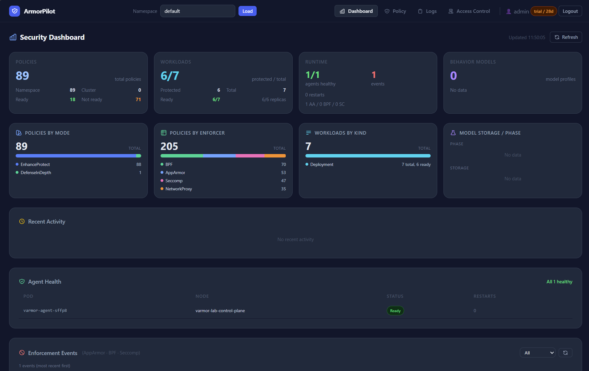
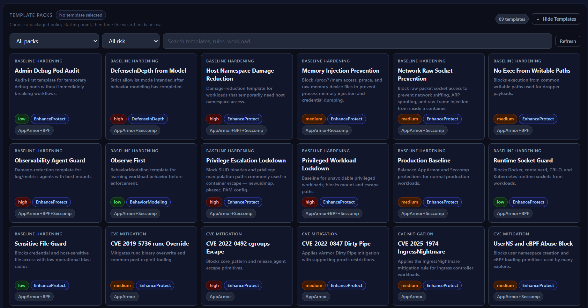
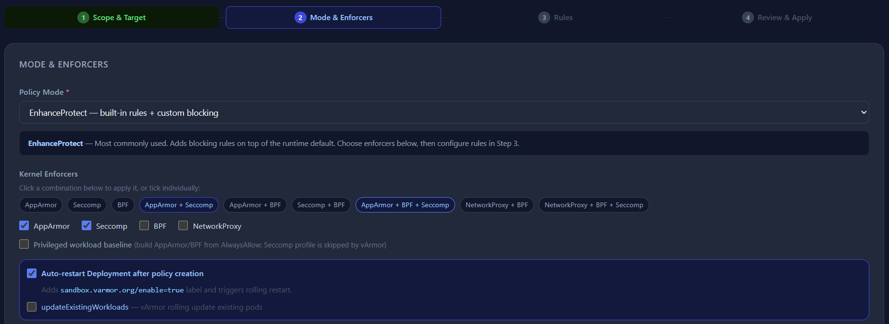
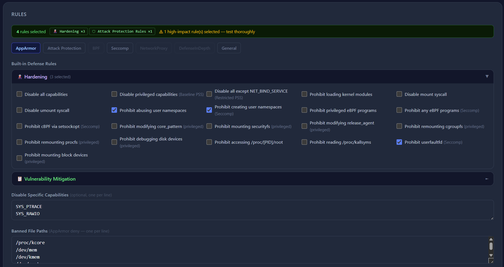
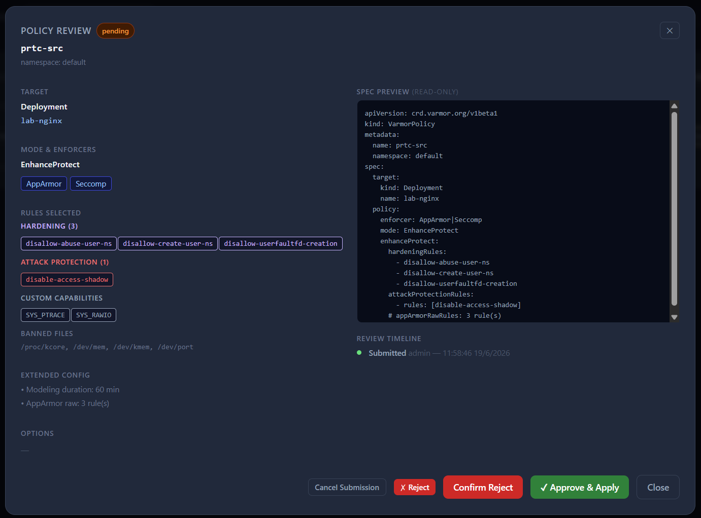
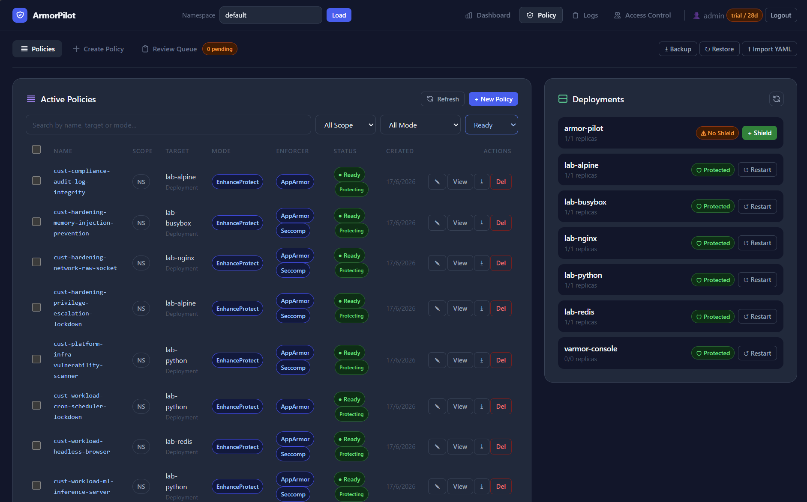
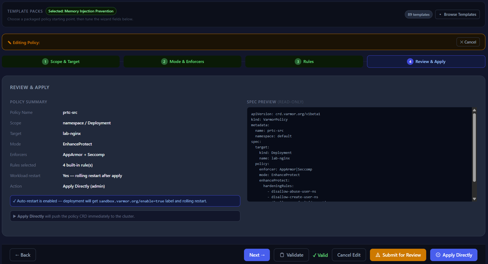
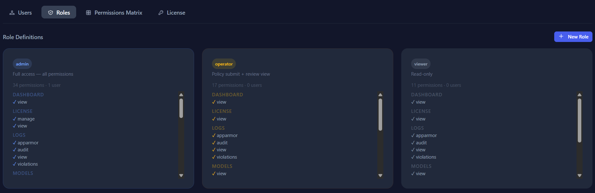
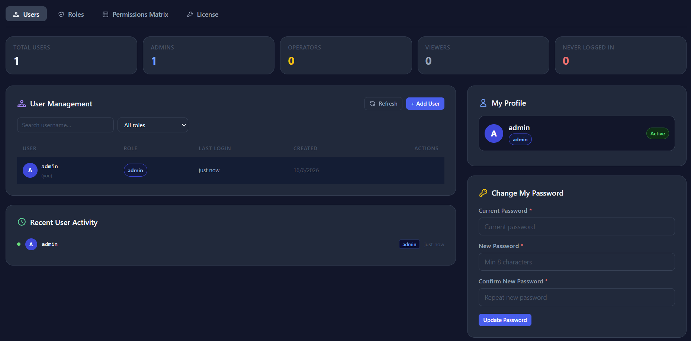
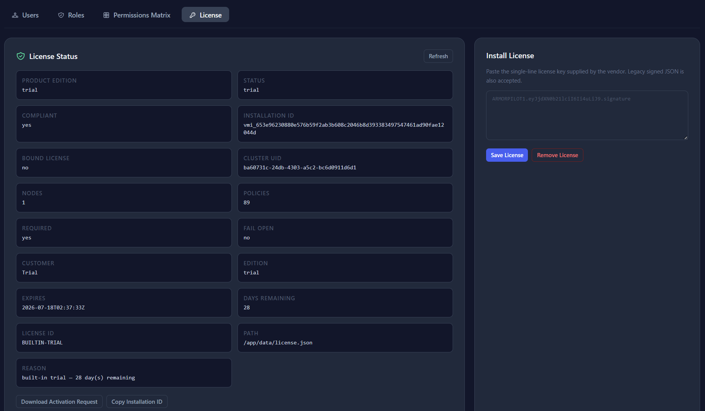

# ArmorPilot

ArmorPilot is a Kubernetes runtime security management platform powered by the
open-source [vArmor](https://github.com/bytedance/vArmor) enforcement engine.
It provides policy creation, review workflows, audit visibility, access
control, behavior-model management, and commercial license activation.

> ArmorPilot is an independent product. It is not affiliated with, endorsed by,
> or an official distribution of the vArmor project or ByteDance.

---

## Architecture


ArmorPilot sits above the Kubernetes API. It generates `VarmorPolicy` and
`VarmorClusterPolicy` CRDs that vArmor agents consume on each node, then
enforce via AppArmor, BPF/eBPF, Seccomp, or NetworkProxy.

---

## Screenshots

### Security Dashboard
Real-time view of policy coverage, workload protection ratio, agent health,
and enforcement events.



---

### Policy Library
Browse and filter 89 built-in template packs — Baseline Hardening, CVE
Mitigations, Attack Protection, and more. One click to start the policy
wizard pre-filled.



---

### Policy Wizard — Mode & Enforcers
Select the enforcement mode (EnhanceProtect, DefenseInDepth, BehaviorModeling,
AlwaysAllow) and combine kernel enforcers. Auto-restart patches the target
deployment without manual `kubectl rollout`.



---

### Policy Wizard — Rules
Granular rule selection across AppArmor, Seccomp, BPF, and NetworkProxy tabs.
Checkbox UI with inline risk labels. Custom capability drops and banned file
paths in the same step.



---

### Policy Wizard — Review & Apply
Full YAML preview before submission. Choose between **Apply Directly** (admin
fast-path) or **Submit for Review** (four-eyes workflow).



---

### Active Policies
Searchable policy table with scope, mode, enforcer, and status. Deployment
shield status on the right panel — green Protected or orange No Shield per
workload.



---

### Policy Review Queue
Pending submissions show full spec preview, timeline, and approve/reject
controls. Approving immediately pushes the CRD to the cluster.



---

### Access Control — Roles
Three built-in roles (admin, operator, viewer) with per-permission visibility.
Custom roles supported via **+ New Role**.



---

### Access Control — Users
User management with role assignment, last-login tracking, and self-service
password change.



---

### License Status
Installation ID, cluster UID, expiry, days remaining, and node/policy usage
counters. Paste the license key from the vendor and hit **Save License**.



---

## Container images

Published releases ship two separate images:

```text
ghcr.io/kaint2051/armor-pilot:<version>             # Community
ghcr.io/kaint2051/armor-pilot-enterprise:<version>  # Commercial
```

The Community image excludes Enterprise template payloads. The Enterprise
image compiles Python backend modules into native extensions and ships no
`.py` source files.

Use a versioned tag or digest in production instead of `latest`.

---

## Kubernetes installation

1. Install vArmor and confirm its CRDs and agents are ready.
2. Pin the Enterprise image tag or digest in `k8s/deployment.yaml`.
3. Create a private environment file:

```bash
cp .env.example .env
chmod 600 .env
```

4. Replace `ADMIN_PASS` and review every setting in `.env`.
5. Deploy:

```bash
./scripts/deploy.sh .env
```

```powershell
.\scripts\deploy.ps1 -EnvFile .env
```

The deployment script creates or updates the Kubernetes Secret
`armor-pilot-secret`, applies the manifests, and waits for the rollout.
The default manifest exposes ArmorPilot on NodePort `30080`.

---

## Migrating an existing installation

The rebrand changes Kubernetes resource names to `armor-pilot` and the default
host data directory to `/var/lib/armor-pilot`. Before replacing an existing
deployment:

1. Back up the old `/app/data` volume (user database, installation identity,
   installed license).
2. Restore into the new ArmorPilot volume.
3. Deploy the new manifests and verify the Installation ID is unchanged.
4. Remove legacy Kubernetes resources only after ArmorPilot is healthy.

---

## Local development

```bash
pip install -r requirements.txt
npm install
npm run build:css
cp .env.example .env
# Set ADMIN_USER and ADMIN_PASS in .env
flask --app app.main:app run --host 0.0.0.0 --port 5000
```

---

## Product configuration

New deployments use the `ARMORPILOT_*` environment variable prefix. Legacy
`VARMOR_*` variables remain accepted during the transition.

Keep the production `.env` outside the repository:

```bash
sudo install -m 600 .env /etc/armor-pilot/armor-pilot.env
./scripts/deploy.sh /etc/armor-pilot/armor-pilot.env
```

Production images run as UID/GID `10001`, use a read-only root filesystem,
and write only to `/app/data` and `/tmp`.

`ADMIN_USER` / `ADMIN_PASS` seed the first administrator only when the user
database is empty. Rotate an existing account password through the Access
Control screen.

---

## Documentation

| Document | Description |
|---|---|
| [System Overview](docs/SYSTEM_OVERVIEW.md) | Architecture, components, policy modes, enforcement engines, RBAC, and API endpoints |
| [User Guide](docs/USER_GUIDE.md) | Login, dashboard, policy management, backup and restore, license management, and audit logs |
| [Open Core Model](docs/OPEN_CORE.md) | Community vs Enterprise edition split and template pack catalogue |
| [Licensing](docs/LICENSING.md) | Offline license activation, installation ID, and license key format |
| [License Pricing](docs/LICENSE_PRICING.md) | Pricing guide and commercial subscription model |

---

## Licensing and attribution

See [LICENSE](LICENSE) and [THIRD_PARTY_NOTICES.md](THIRD_PARTY_NOTICES.md).
