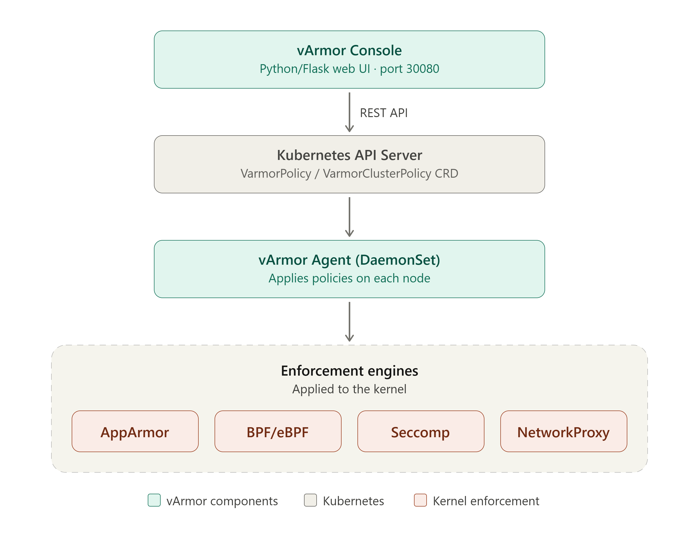

# ArmorPilot — System Overview

## 1. Introduction

**vArmor** is a cloud-native container runtime security system running on Kubernetes. ArmorPilot is an independent web-based management platform for creating, managing, and monitoring **security policies** applied directly to workloads (Deployments, StatefulSets, DaemonSets, Pods) within the cluster.

The system operates on an **eBPF + LSM** (Linux Security Module) model, intercepting at the kernel level to block dangerous behaviors without modifying container images or application configuration.

---

## 2. System Architecture



### Key Components

| Component | Description |
|---|---|
| **ArmorPilot** | Web management UI and REST API server |
| **vArmor Manager** | Controller that processes VarmorPolicy / VarmorClusterPolicy CRDs |
| **vArmor Agent** | DaemonSet running on each node, receiving instructions from the Manager |
| **Enforcement Engines** | AppArmor, BPF, Seccomp, NetworkProxy — the enforcement layer |
| **Database (SQLite)** | Stores users, roles, and the internal console audit log |
| **PVC Storage** | Stores the license, installation key, and behavioral models |

---

## 3. Policy Modes

### 3.1 AlwaysAllow
- **Purpose**: Applies no restrictions whatsoever.
- **Use when**: Temporarily disabling protection for debugging, or marking a fully trusted workload.
- **Risk**: High — the container has unrestricted access.

### 3.2 RuntimeDefault
- **Purpose**: Applies the default security profile of the container runtime (containerd / Docker).
- **Use when**: Establishing a minimum security baseline for general workloads.
- **Characteristics**: Blocks common dangerous syscalls; no additional configuration required.

### 3.3 EnhanceProtect ⭐ (most commonly used)
- **Purpose**: Active, rule-based protection with three layers:
  - **Hardening Rules**: Lock down system weaknesses (mount, insmod, capabilities)
  - **Attack Protection Rules**: Block post-intrusion techniques (shell, wget, metadata service access)
  - **Vulnerability Mitigation Rules**: Patch known CVEs (Dirty Pipe, runc override, etc.)
- **Use when**: Production environments requiring advanced protection.
- **Supported Enforcers**: AppArmor, BPF, Seccomp, NetworkProxy.

### 3.4 BehaviorModeling
- **Purpose**: Observes and records the actual runtime behavior of the workload (learning mode).
- **Use when**: The initial phase — letting the system learn a behavioral profile before enforcing protection.
- **Flow**: BehaviorModeling → (complete) → DefenseInDepth
- **Note**: While modeling, the workload is not restricted in any way.

### 3.5 DefenseInDepth
- **Purpose**: Strict allowlist — permits only the exact behaviors captured during modeling.
- **Use when**: After BehaviorModeling is complete, to enforce the learned profile.
- **Characteristics**: The strongest mode, but prone to blocking legitimate actions if the profile is incomplete.

---

## 4. Enforcement Engines

### 4.1 AppArmor
- **Layer**: LSM (Linux Security Module) in the kernel.
- **Controls**: File system access, capabilities, network, mounts.
- **Requirements**: Kernel with AppArmor enabled (enabled by default on Ubuntu and Debian).
- **Profile**: Text-based rules applied directly to the kernel.

### 4.2 BPF (eBPF)
- **Layer**: eBPF programs hooked into kernel events.
- **Controls**: Syscall-level, network, file, process.
- **Requirements**: Kernel ≥ 5.10, BTF enabled, CAP_SYS_ADMIN.
- **Advantages**: More flexible than AppArmor; supports NetworkProxy.

### 4.3 Seccomp
- **Layer**: Syscall filter at the process level.
- **Controls**: Allowlist or blocklist of syscalls.
- **Requirements**: Kernel ≥ 3.17 (most modern distributions).
- **Actions**: SCMP_ACT_KILL, SCMP_ACT_ERRNO, SCMP_ACT_LOG, SCMP_ACT_ALLOW.

### 4.4 NetworkProxy
- **Layer**: Transparent proxy for network traffic.
- **Controls**: Egress traffic by domain, IP, or port.
- **Requirements**: BPF engine must be available.
- **Use when**: Fine-grained control over outbound container traffic is required.

### Valid Enforcer Combinations

| Combination | Notes |
|---|---|
| AppArmor | Most basic |
| BPF | More powerful than AppArmor |
| Seccomp | Syscall filtering |
| AppArmor + BPF | Combines file + syscall protection |
| AppArmor + Seccomp | Common production setup |
| BPF + Seccomp | eBPF + syscall filter |
| BPF + NetworkProxy | Network egress control |
| AppArmor + BPF + Seccomp | Comprehensive protection |

---

## 5. Policy Scope

| Scope | CRD | Applies To |
|---|---|---|
| **Namespace** | `VarmorPolicy` | Workloads in a specific namespace |
| **Cluster** | `VarmorClusterPolicy` | Workloads in any namespace (cluster-wide) |

---

## 6. Target (Workload Selection)

Policies are applied to workloads in two ways:

### 6.1 By Name
```yaml
target:
  kind: Deployment
  name: nginx-frontend
```
Applies to exactly one Deployment / StatefulSet / DaemonSet / Pod with the specified name.

### 6.2 By Label Selector
```yaml
target:
  kind: Deployment
  selector:
    matchLabels:
      app: web
    matchExpressions:
      - key: env
        operator: In
        values: [production, staging]
```
Applies to all workloads matching the labels. Supported operators: `In`, `NotIn`, `Exists`, `DoesNotExist`.

---

## 7. License System

### 7.1 License States

| State | Meaning |
|---|---|
| **trial** | Built-in 30-day trial, starting from the installation date |
| **valid** | Full license, not yet expired |
| **in_grace** | Expired but within the grace period — system still operates normally |
| **missing** | No license installed and trial has expired |
| **invalid** | License error (e.g., wrong key format or bound to a different system) |

### 7.2 License Editions

| Edition | Target | Features |
|---|---|---|
| **Trial** | Evaluation / testing | All features, 30 days, limited to the trial period |
| **Starter** | Small teams | Core protection features, limited nodes and policies |
| **Enterprise** | Organizations | Full features, policy templates, no node/policy limits |

### 7.3 License Limits

| Limit | Description |
|---|---|
| **Max Nodes** | Maximum number of cluster nodes covered by the license (0 = unlimited) |
| **Max Policies** | Maximum number of active policies allowed (0 = unlimited) |
| **Grace Days** | Number of additional days the system remains operational after the license expires |
| **Expiry Date** | The date the license stops being valid (plus any grace period) |

---

## 8. RBAC (Role-Based Access Control)

### 8.1 Built-in Roles

#### admin
Full system access. Intended for system administrators.

#### operator
Can create and submit policies for admin approval. Cannot apply policies directly.

#### viewer
Read-only. Cannot create, edit, or delete any resources.

### 8.2 Permission List

| Permission | Description |
|---|---|
| `dashboard:view` | View the Dashboard |
| `policies:view` | View the policy list |
| `policies:create` | Create new policies |
| `policies:validate` | Validate a policy before applying |
| `policies:submit` | Submit a policy for admin approval |
| `policies:edit` | Edit existing policies |
| `policies:delete` | Delete policies |
| `policies:apply_direct` | Apply a policy directly (no approval required) |
| `policies:import` | Import policies from a file |
| `policies:export` | Export policies to a file |
| `review:view` | View the approval queue |
| `review:approve` | Approve a policy |
| `review:reject` | Reject a policy |
| `review:cancel` | Cancel a pending request |
| `logs:view` | View security logs |
| `logs:audit` | View the audit trail |
| `logs:violations` | View security violations |
| `logs:apparmor` | View AppArmor events |
| `models:view` | View behavioral models |
| `models:advisor` | View model-based recommendations |
| `models:apply` | Apply a behavioral model |
| `users:view` | View the user list |
| `users:create` | Create new users |
| `users:update_role` | Change a user's role |
| `users:reset_password` | Reset another user's password |
| `users:delete` | Delete users |
| `license:view` | View license information |
| `license:manage` | Install or remove a license |

### 8.3 Custom Roles
Admins can create custom roles with any combination of permissions from the list above.

---

## 9. Policy Templates

The system ships with 72 built-in templates organized into 8 groups:

| Group | Templates | License Required |
|---|---|---|
| Baseline Hardening | 10 | No |
| CVE Mitigation | 9 | No |
| Compliance | 13 | No |
| Workload Type | 18 | No |
| Network Egress | 7 | No |
| Data Protection | 5 | Enterprise |
| Platform Infrastructure | 15 | Enterprise |
| Incident Response | 2 | Enterprise |

---

## 10. Key API Endpoints

| Method | Endpoint | Permission | Description |
|---|---|---|---|
| GET | `/api/namespaces/:ns/policies` | policies:view | List policies in a namespace |
| POST | `/api/policies` | policies:apply_direct | Create a new policy |
| PUT | `/api/namespaces/:ns/policies/:name` | policies:edit | Edit a policy |
| DELETE | `/api/namespaces/:ns/policies/:name` | policies:delete | Delete a policy |
| GET | `/api/cluster-policies` | policies:view | List cluster policies |
| GET | `/api/license` | license:view | Get license status |
| POST | `/api/license` | license:manage | Install a license |
| DELETE | `/api/license` | license:manage | Remove the license |
| GET | `/api/license/activation-request` | license:view | Get activation request data |
| GET | `/api/users` | users:view | List users |
| POST | `/api/users` | users:create | Create a user |
| DELETE | `/api/users/:username` | users:delete | Delete a user |
| GET | `/api/audit-logs` | logs:audit | Get audit trail |
| GET | `/api/apparmor-events` | logs:apparmor | Get AppArmor events |
| GET | `/api/policy-templates` | policies:view | List policy templates |
| GET | `/api/policies/backup` | policies:export | Backup policies |
| POST | `/api/policies/restore` | policies:apply_direct | Restore directly |
| POST | `/api/policies/restore/submit` | policies:submit | Restore via approval queue |

---

## 11. Environment Variables

| Variable | Default | Description |
|---|---|---|
| `ARMORPILOT_LICENSE_REQUIRED` | Build profile | Enterprise defaults true; Community defaults false |
| `ARMORPILOT_LICENSE_FAIL_OPEN` | Build profile | Only source/development builds default to fail-open |
| `ARMORPILOT_LICENSE_REQUIRE_INSTALLATION_BINDING` | Build profile | Enterprise defaults true; Community defaults false |
| `ARMORPILOT_LICENSE_ALLOW_ENV_PUBLIC_KEY` | Development only | Production images compile out runtime public-key replacement |
| `ARMORPILOT_LICENSE_ALLOW_HS256` | Development only | Production images compile out legacy HS256 verification |
| `ARMORPILOT_TRIAL_DAYS` | 0 | Source-only built-in trial duration; production images compile it out |
| `ARMORPILOT_LICENSE_FILE` | /app/data/license.json | Path to the license file |

---

## 12. Operational Workflows

### Creating and Applying a Policy (Admin)
```
Admin creates policy → Validate → Apply directly
                                      ↓
                           VarmorPolicy CRD created in k8s
                                      ↓
                           vArmor Manager receives event
                                      ↓
                           vArmor Agent on node receives profile
                                      ↓
                           Kernel AppArmor/BPF/Seccomp enforces it
                                      ↓
                           Policy Status: Ready
```

### Creating a Policy (Operator — via review)
```
Operator creates policy → Submit → Pending approval queue
                                      ↓
                           Admin views Review Queue
                                      ↓
                           Approve → Apply → Ready
                           Reject  → Discarded
```

### License Lifecycle
```
Fresh install → Built-in 30-day trial starts automatically
                    ↓ (trial expires)
         Download Activation Request (contains installation info + license request)
                    ↓
         Send to Vendor
                    ↓
         Vendor signs license with private key → ARMORPILOT1.xxx.yyy
                    ↓
         Paste key into Console → License Valid
```
